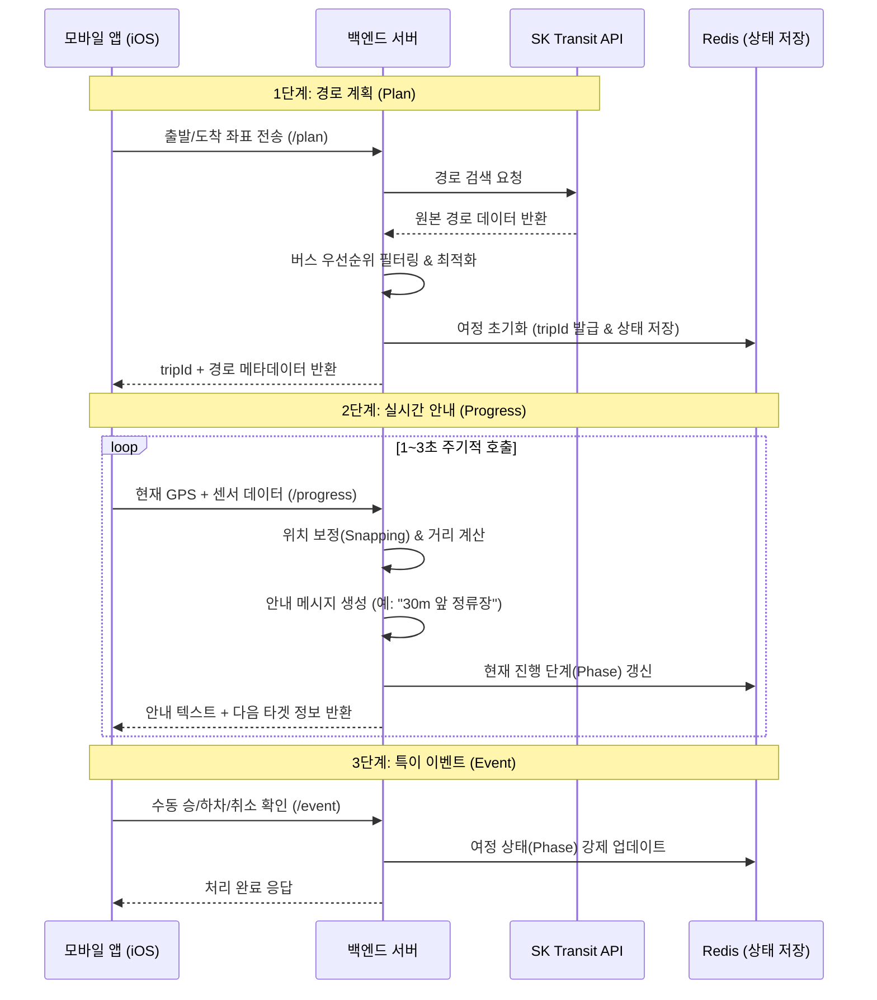

# 🚍 스마트 지팡이 대중교통 안내 (SmartCane Transit) 프로젝트 요약

본 문서는 시각 및 이동 약자를 위한 대중교통 길안내 백엔드 서비스의 개발 현황과 향후 계획을 정리한 문서입니다. 기획팀과 앱 개발팀의 협업 가이드로 활용하시기 바랍니다.

---

## 📌 프로젝트 개요
**SmartCane Transit**은 시각 장애인이 안전하고 편리하게 대중교통(버스/지하철)을 이용할 수 있도록 돕는 백엔드 솔루션입니다. SK 대중교통 API를 기반으로 경로를 탐색하고, 모바일 센서 데이터와 GPS를 결합하여 실시간 승·하차 안내 및 경로 이탈 방지 기능을 제공합니다.

---

## 📊 시스템 워크플로우 (Workflow Diagram)

---

## 🧠 주요 비즈니스 로직 (Core Business Logic)

### 1. 경로 탐색 및 세션 초기화 (`/plan`)
- **약자 맞춤형 필터링**: 시각 장애인이 이용하기 어려운 복잡한 환승보다는, **'버스 전용'** 또는 **'단순 환승'** 경로를 최우선으로 정렬하여 앱에 제공합니다.
- **세션 관리**: 모든 실시간 안내는 서버에서 발급한 `tripId`를 기준으로 관리되며, 이는 Redis에 저장되어 앱이 재실행되어도 세션 복구가 가능합니다.

### 2. 실시간 가이드 및 상태 추적 (`/progress`)
- **폴리라인 스내핑(Snapping)**: GPS 오차를 보정하기 위해 사용자의 위치를 실제 도로/경로 데이터(Polyline) 위로 보정하여 안내의 정확도를 높입니다.
- **동적 안내 생성**: 사용자의 현재 위치와 다음 경유지 간의 거리를 실시간으로 계산하여 상황에 맞는 텍스트 가이드(TTS용)를 제공합니다.

### 3. 승·하차 및 단계 전환 로직
- **자동 감지**: 정류장 반경(Geofence) 진입과 이동 속도 변화를 분석하여 `보행`에서 `탑승` 상태로 자동 전환을 시도합니다.
- **수동 보정**: 자동 감지가 실패할 경우 사용자가 앱에서 직접 승/하차를 확정할 수 있도록 이벤트 시스템을 갖추고 있습니다.

---

## ✅ 현재 구현 현황 (Implementation Status)

- [x] **SK API 연동**: 경로 조회 및 버스 우선 필터링.
- [x] **상태 머신 구현**: `보행` -> `탑승중` -> `환승` -> `도착` 단계 관리.
- [x] **실시간 세션**: Redis 기반 고속 상태 저장 및 로드.
- [x] **거리 기반 안내**: 다음 타겟까지의 실시간 거리 및 텍스트 생성 로직.

---

## 📡 주요 API 명세 (앱 개발자 참고)

| 엔드포인트 | 메서드 | 설명 | 호출 시점 |
| :--- | :--- | :--- | :--- |
| `/api/transit/plan` | `POST` | 경로 검색 및 `tripId` 발급 | 길찾기 시작 시 |
| `/api/transit/trips/{id}/progress` | `POST` | GPS/센서 전송 및 가이드 수신 | 여정 중 주기적 호출 (1~3초) |
| `/api/transit/trips/{id}/event` | `POST` | 수동 상태 변경 (승/하차 확인 등) | 특정 인터랙션 발생 시 |

---

## 🗺 향후 프로젝트 과제 (Roadmap)

1. **IMU 센서 융합**: 가속도/자이로 데이터를 분석하여 버스 출발/정지 패턴 정밀 분석.
2. **지하철 음영 구역 보정**: 지하 역사 내 Wi-Fi 스캔 데이터를 활용한 위치 추정 로직 추가.
3. **실시간 버스 매칭**: 도착 예정 버스 정보와 사용자의 대기 위치를 실시간으로 매칭하여 탑승 안내.

---

## 🤝 협업 요청 사항
- **기획팀**: 정류장 진입 안내를 보낼 최종 "안내 거리" 임계값 확정 필요.
- **앱 개발팀**: Background 모드에서의 데이터 전송 주기 및 센서 데이터 수집 규격 논의.
